# 台灣硬幣即時辨識與總計系統 (OpenCV 實作)

##  專案簡介
本專案使用 **OpenCV** 傳統視覺處理技術，透過電腦內建視訊鏡頭，即時偵測台灣硬幣（1元、5元、10元、50元），並計算畫面上硬幣的總金額。

---

##  開發環境
* **作業系統**: Windows 10/11
* **開發環境**: Python 3.10
* **必要庫**: 
  * `opencv-python` (4.x+)
  * `numpy`
* **硬體**: 電腦內建視訊鏡頭或普通 USB 視訊鏡頭

---

## 邏輯介紹
本程式不單純依賴單幀的圓形偵測，而是結合了時間序列的資料處理：

1. **開啟相機內容**
    * 系統透過 cv2.VideoCapture 介面串接電腦視訊鏡頭，以每秒約 30 幀（FPS）的速度獲取即時影像，作為後續辨識的原始數據輸入。

        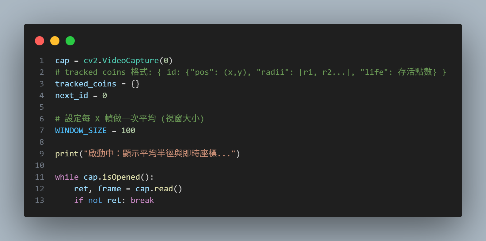

2. **影像灰階化與高斯模糊**
   * 灰階化：將影像轉為單色灰階，降低運算複雜度並消除色彩干擾。
    高斯模糊 (Gaussian Blur)：對影像進行平滑化，目的是消弭硬幣表面的數字刻紋、金屬反光與細微雜訊，使邊緣更平整，利於演算法精準抓取圓周。

        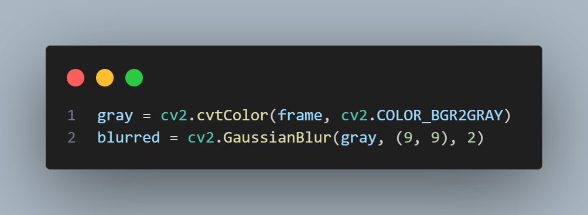

1. **HoughCircles 偵測圓形**
    * 利用「霍夫圓變換」演算法在影像中搜尋幾何圓形。此步驟會輸出每一幀中偵測到的圓心座標 $(x, y)$ 與原始半徑 $r$。

        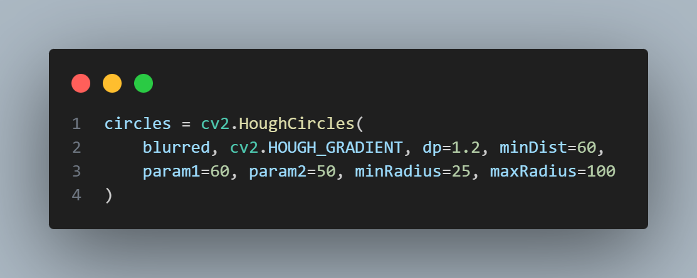

1. **是否在追蹤範圍內？**
    * 系統具備「記憶」功能的關鍵判斷。將「當前偵測到的圓」與「上一幀已記錄的硬幣」進行位置比對：
    距離公式：計算兩者圓心的歐幾里得距離 $d = \sqrt{(x_2-x_1)^2 + (y_2-y_1)^2}$。
    若 $d < 30$ 像素，則判定為同一個物件。

    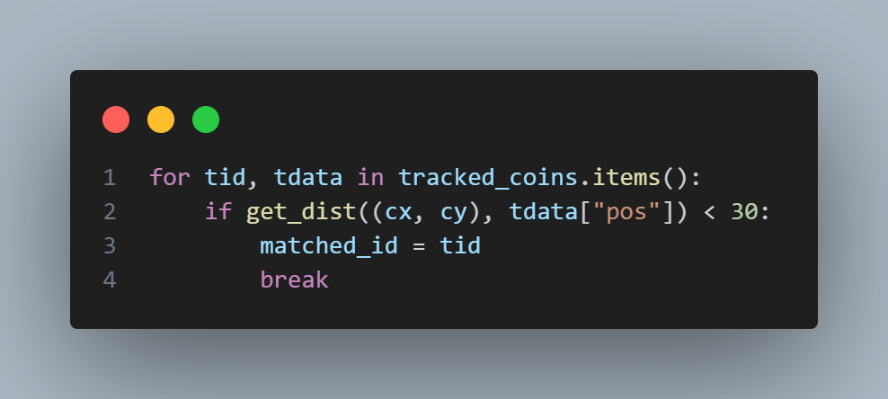

1. **更新舊硬幣 ID 的半徑紀錄**
    * 若判定為老朋友（已存在硬幣），系統會將新半徑數值寫入該 ID 的歷史紀錄清單，並重置其「生命值」。

        

1. **建立新硬幣 ID 並給予生命值**
    * 若無匹配紀錄，則視為新硬幣，分配新 ID 並給予初始生命值（Life System）。此機制可防止硬幣因短暫遮擋或閃爍而導致計數立即消失。

        

1. **計算 100 幀平均半徑**
    * 為了消除陰影導致的誤差，系統取該硬幣最近 100 幀的半徑數值進行平均運算（Moving Average）。這能讓 $r$ 值極其穩定，不受單幀影像雜訊影響。

        

1. **面額判定 (1, 5, 10, 50)**
    * 將穩定後的「平均半徑」與預設的台灣硬幣尺寸閾值進行比對，進而判定硬幣種類。

        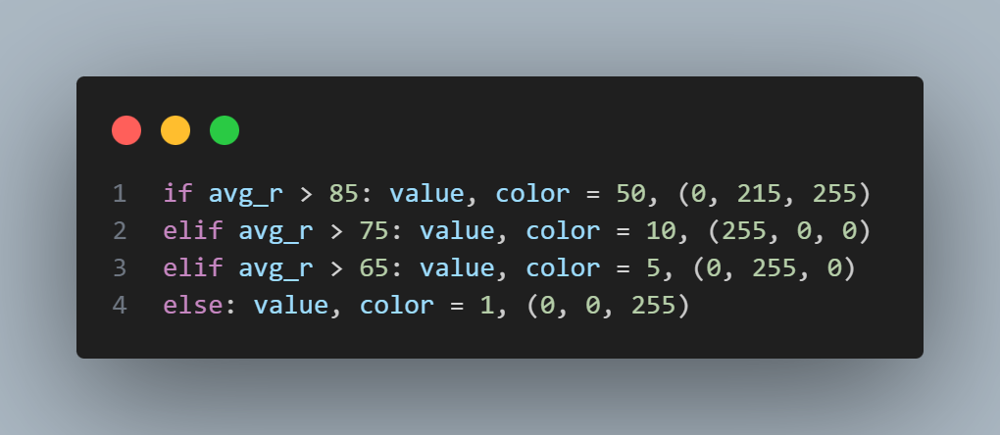

1. **繪製結果與座標顯示**
    * 在畫面上即時繪製辨識結果，包括面額、平均半徑值以及即時座標 Loc:(x, y)，方便觀測硬幣在不同位置的變形程度。

        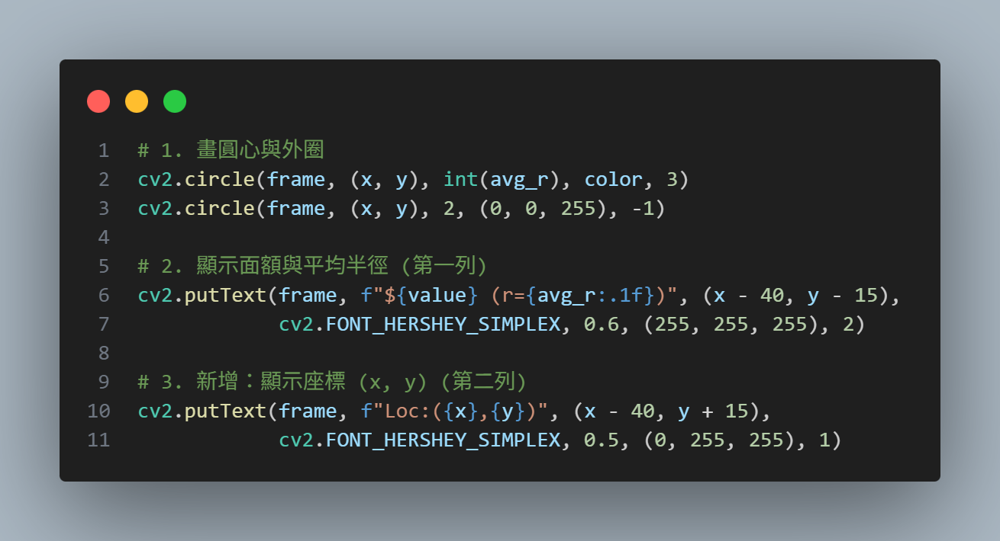

1.  **計算總金額**
    * 遍歷所有在線（生命值 > 0）的硬幣，將其對應面額加總，並顯示於畫面左上角。

        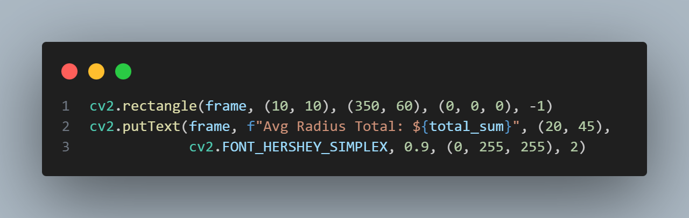

---

## 📊 處理流程圖

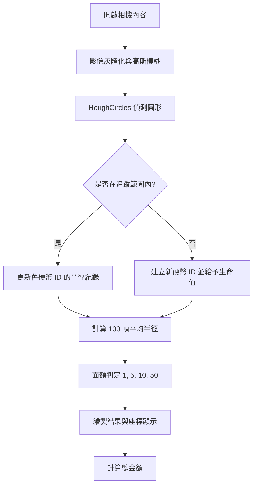

---

## ⚠️ 遇到問題與解決方式

### 1. 陰影導致半徑誤差大
* **問題**: 光源從側面照射時，硬幣旁的深色陰影常被誤認成圓周的一部分，導致偵測出的半徑 `r` 偏大（例如 10 元被認成 50 元）。
* **解決方式**: 
    * 將影像先做**模糊化處理**，讓陰影的邊緣不再銳利，減少演算法對陰影邊界的敏感度。
    * **座標穩定化**: 只要圓心移動在閾值範圍內都視為同一個物件，不重新判定。

### 2. 金額頻繁跳動
* **問題**: 圓形偵測在每一幀的數據會有些微偏移，導致總金額在 10、11、60 之間跳動。
* **解決方式**: 引入 **100 幀直徑平均化**。透過歷史紀錄取平均值，讓半徑數值趨於穩定，不再因單一幀的誤差而改變面額判定。

---

## 🚀 成果展示

### 系統表現

> **圖片說明** : 系統可穩定顯示硬幣座標、平均半徑及分類面額。

### 問題分析紀錄
1. **陰影錯誤偵測**
    * 原因:會誤判陰影導致半徑無法穩定
    * 解決方式:將圖片先做模糊化
    偵測每個硬幣位置 在閾值內都視為同一個
    將每100幀的直徑做平均化

        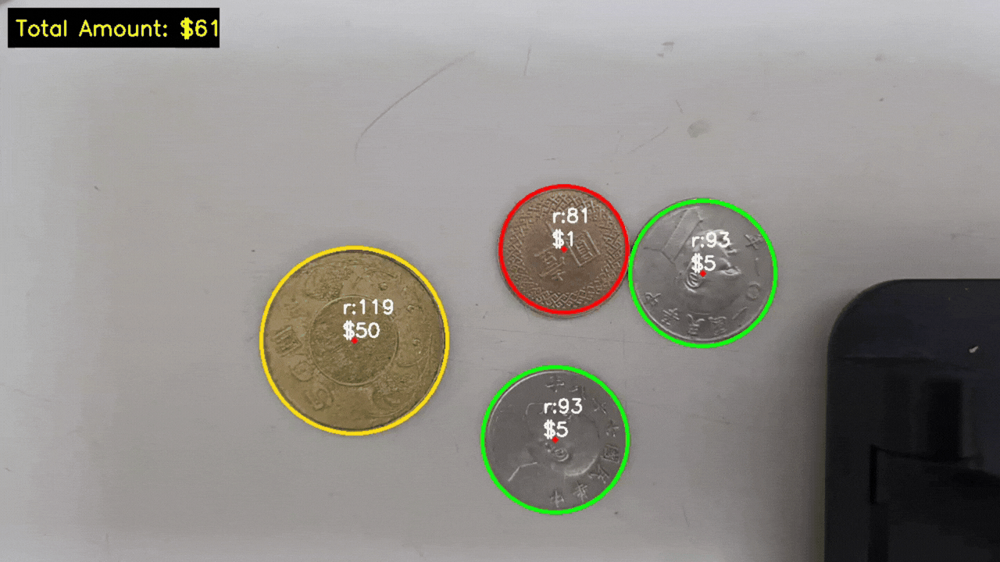

    **問Gemini的問題**

        將原有的程式碼複製貼上再加上提示詞:
        先將值做平均在做判斷 像是每X偵做平均半徑
        
    
    **Gemini的回應**

    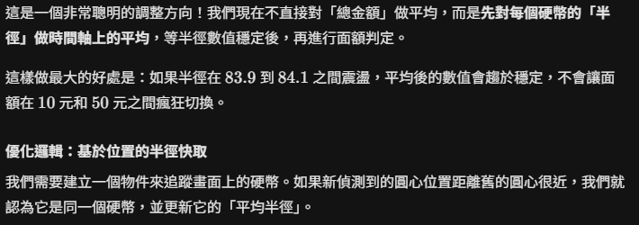

    **Gemini修改了什麼**

    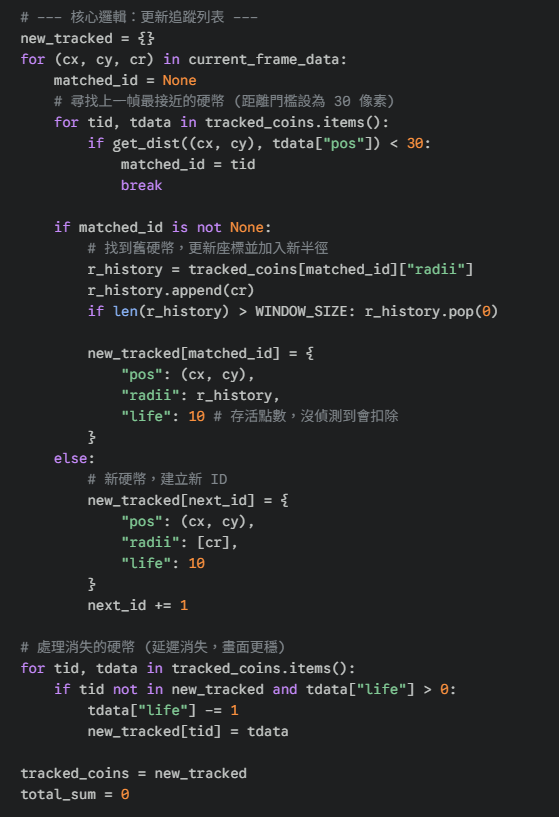

---

## 目前限制與改進方向

1.  **距離固定限制**:
    * **原因**: 目前僅用像素直徑判斷。當鏡頭高度改變，半徑也會隨之改變，造成誤判。
    * **解決方案**: 考慮在桌面上固定一個**參考物件**（如 5 公分長的標籤），以此作為像素與實際長度的轉換基準。
  
        

1.  **複雜場景辨識錯誤**:
    * **原因**: OpenCV 僅辨識「幾何圓形」，無法分辨物件紋理。
    * **解決方案**: 後續可導入 **YOLOv11** AI 模型。OpenCV 負責抓位置，YOLO 負責看圖案特徵，結合兩者優點以達到 100% 的辨識度。
  
        
