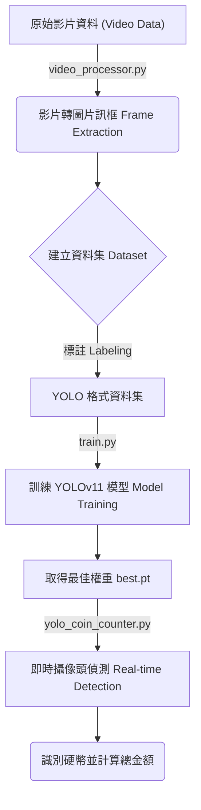

# Coin Detection with YOLOv11

## 1. 介紹 (Introduction)
本專案旨在利用 YOLOv11 (You Only Look Once) 深度學習模型來實現硬幣的自動偵測與面額計算。透過電腦視覺技術，系統能夠即時識別攝影機畫面中的硬幣種類（如 1元、5元、10元、50元），並自動加總當前畫面中的總金額。這可以應用於自動販賣機、收銀系統或財務輔助工具中。

## 2. 流程圖 (Flowchart)
本專案的運作流程如下圖所示：

## 3. 功能 (Features)
本專案包含以下核心功能：
- **影片資料預處理**: 透過 `video_processor.py` 自動掃描目錄下的影片檔，並將其分割為圖片幀（Frames），自動依據資料夾名稱分類，建立訓練所需的圖像數據集。
- **高效模型訓練**: 使用 `train.py` 調用 Ultralytics YOLOv11m 模型進行訓練，針對硬幣特徵進行優化 (預設 100 epochs, 640x640 解析度)。
- **即時偵測與計數**: `yolo_coin_counter.py` 腳本可啟動攝影機，即時捕捉畫面，識別硬幣種類（支援自定義面額對應），並在畫面上即時顯示個別硬幣金額與總金額。

## 4. 成果 (Results)
- 成功框選出硬幣之位置，但硬幣種類有誤

    

    

## 5. 可能失敗原因 (Potential Failure Causes)
可能失敗的原因：
- **資料集多樣性不足 (Dataset Limitation)**: 目前的訓練資料集**太少混合硬幣**的場景。大多數的訓練圖片都是**單一硬幣的特寫**（Single Coin Close-ups），缺乏多個硬幣重疊、遮擋或散落在複雜背景下的樣本。這導致模型在面對真實場景（多種硬幣混雜）時，可能會出現誤判、漏抓或無法區分相鄰硬幣的情況。
- **環境光線變化**: 若測試環境光線與訓練集差異過大（如反光、陰影），也會影響金屬硬幣的特徵提取。
