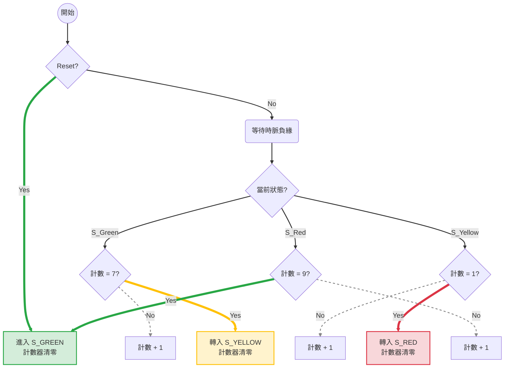
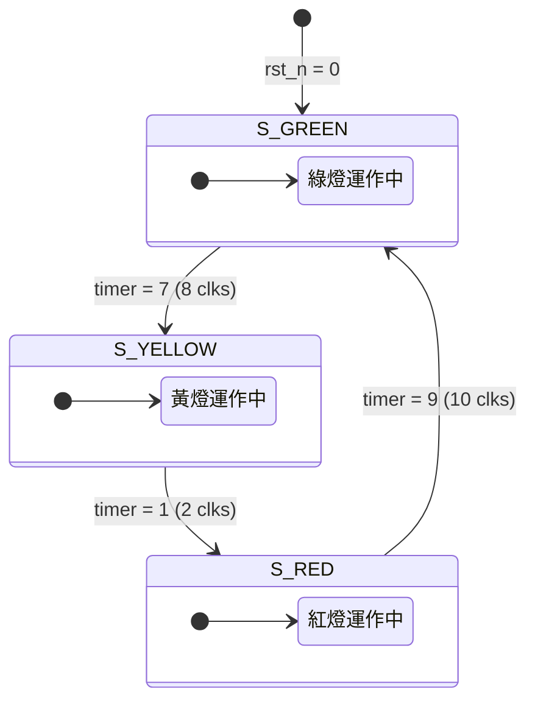
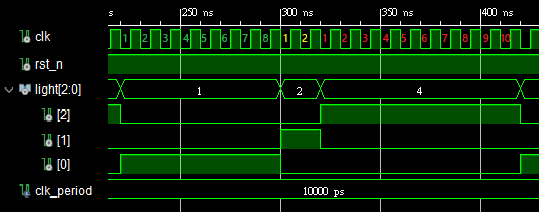
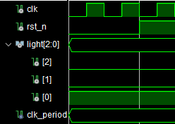

# 交通號誌控制系統設計 (Traffic Light FSM)

本專案使用 **VHDL** 語言設計一個基於有限狀態機（FSM）的交通號誌控制器。

## 1. 專案介紹
本設計模擬標準十字路口的紅綠燈循環邏輯。系統透過一個內部計數器來精確控制每個燈號狀態的持續時間。

### 規格要求：
* **綠燈 (Green)**：持續 8 個時脈週期 (Clock Cycles)。
* **黃燈 (Yellow)**：持續 2 個時脈週期 (Clock Cycles)。
* **紅燈 (Red)**：持續 10 個時脈週期 (Clock Cycles)。
* **循環順序**：綠燈 -> 黃燈 -> 紅燈 -> 綠燈。

---

## 2. 邏輯流程圖 (Flowchart)

---

## 3.狀態轉移圖

---

## 3. 硬體架構 (Architecture)

本系統由兩個主要部分組成：
1.  **時序邏輯 (Sequential Logic)**：處理時脈正邊緣觸發與重置訊號。
2.  **狀態轉換邏輯 (Next State Logic)**：判斷 `timer` 是否達到設定上限（如綠燈 8 clks）。

### 狀態編碼表：
| 狀態名稱 | 燈號輸出 (R, Y, G) | 持續時間 |
| :--- | :--- | :--- |
| S_GREEN | 001 | 8 Clks |
| S_YELLOW | 010 | 2 Clks |
| S_RED | 100 | 10 Clks |

---

## 4. 模擬成果 (Results)

透過 VHDL Testbench 進行功能驗證，下圖展示了時序波形的模擬結果：

### 模擬現象觀察：
1.  **Reset 階段**：當 `rst_n` 為低電位時，輸出立即回到 `S_GREEN`。
   
   

2.  **自動循環**：
    * 在時脈第 1 到 8 個週期顯示綠燈。
    * 第 9 到 10 個週期轉換為黃燈。
    * 第 11 到 20 個週期轉換為紅燈，隨後回到綠燈完成循環。

---

