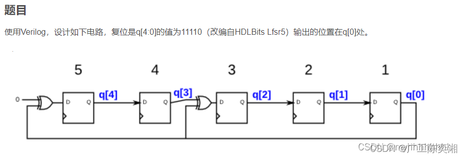
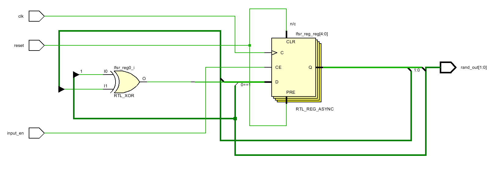

# 0-3 Random Number Generator (CRC5-LFSR Based)

本專案實作一個硬體高效的偽隨機數生成器 (PRNG)。利用 **CRC5** 多項式邏輯構建線性回饋移位暫存器 (LFSR)，產生 0 到 3 (2-bit) 的隨機序列，適用於數位系統、加密通訊或硬體模擬等應用。

## 1. 系統特性
- **算法**: 基於 CRC5 多項式 $X^5 + X^2 + 1$。
- **輸入 (Input)**: 具備 `input_en` 致能控制，僅在輸入為 '1' 時觸發狀態跳轉。
- **輸出 (Output)**: 2-bit 隨機訊號，精準覆蓋 0, 1, 2, 3 四個數值。

---

## 2. 硬體架構與電路 (Hardware Architecture)

### 電路原理圖 (Circuit Diagram)
本設計核心為一個 5-bit LFSR。為了確保隨機分佈，我們採用了非零種子值（Seed）進行初始化，避免進入 LFSR 的死亡迴圈（All-zero state）。

> **出處** : https://blog.csdn.net/weixin_35754962/article/details/149814519

---

## 3. RTL

---

## 4.成果展示

