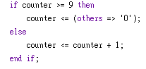
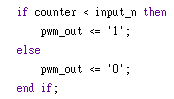
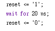
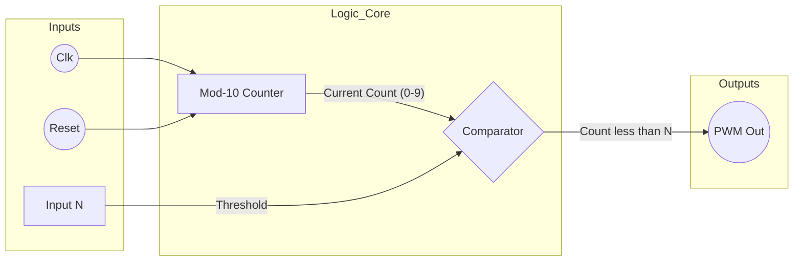
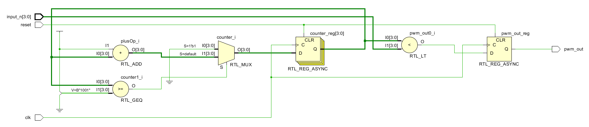
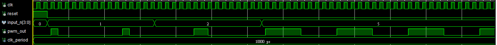

# VHDL Adjustable Duty Cycle PWM Generator

這是一個基於 VHDL 設計的參數化 PWM (脈衝寬度調變) 產生器。該模組接收一個數值輸入 $N$，並根據 $N \times 10\%$ 的公式動態調整輸出訊號的占空比 (Duty Cycle)。

## 📖 專案簡介 (Overview)

本專案展示了數位邏輯設計中「計數器」與「比較器」的經典應用。
* **輸入**: `input_n` (4-bit unsigned)，有效範圍為 1 到 9。
* **輸出**: `pwm_out` (1-bit PWM 訊號)。
* **規格**: 
    * 基頻週期為 10 個時鐘週期 (Mod-10 Counter)。
    * 占空比解析度為 10%。
    * 當輸入為 1 時，占空比為 10%；輸入為 5 時，占空比為 50%。

---
## 🛠️ 硬體架構 (PWM_Generator)

此模組使用一個內部計數器來產生固定的 PWM 頻率，並根據輸入值調整占空比 (Duty Cycle)。

### 介面訊號 (Ports)
定義於 `PWM_Generator.vhd`：
* **clk** (`in`): 系統時鐘。
* **reset** (`in`): 非同步重設訊號 (高電位有效)。
* **input_n** (`in`, 4-bit): 占空比控制值。
* **pwm_out** (`out`): PWM 輸出訊號。

### 運作原理
1. **計數器 (Counter)**: 
   模組內部有一個 `unsigned(3 downto 0)` 的計數器，計數範圍為 **0 到 9**。

   

2. **比較邏輯 (Comparator)**:
   輸出訊號 `pwm_out` 的邏輯如下：
   * 當 `counter < input_n` 時，輸出 `1` (High)。
   * 否則，輸出 `0` (Low)。

        

   > **範例**: 若 `input_n = 1`，只有當計數器為 0 時輸出 High，占空比為 1/10 (10%)。

---

## 🧪 模擬與驗證 (Testbench)

`PWM_Generator_tb.vhd` 檔案用於模擬設計。它建立了一個虛擬環境，不包含任何外部 Port 。

### 模擬設定
* **時鐘頻率**: 設定週期為 **10 ns** (相當於 100 MHz)。
* **模擬時間**: 設定總模擬時間為 1000 ns。

### 測試流程 (Test Case)
Testbench 依序執行以下測試情境：

1. **系統重設 (Reset)**:
   * 拉高 `reset` 訊號維持 20 ns，確保計數器歸零。
  
        

2. **測試案例 1: 10% 占空比**:
   * 設定 `input_n = "0001"` (數值 1)。
   * 預期波形: 1個週期 High，9個週期 Low。

        

3. **測試案例 2: 20% 占空比**:
   * 設定 `input_n = "0010"` (數值 2)。
   * 預期波形: 2個週期 High，8個週期 Low。
  
        

4. **測試案例 3: 50% 占空比**:
   * 設定 `input_n = "0101"` (數值 5)。
   * 預期波形: 5個週期 High，5個週期 Low (方波)。

        

---

## 系統架構 (System Architecture)

### 1. 硬體電路圖 (Block Diagram)
系統由一個模數為 10 的計數器 (Counter) 與一個比較器 (Comparator) 組成。

---

## RTL

---

## 成果展示

---