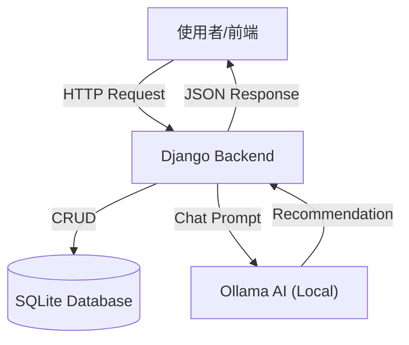

# 智慧圖書館管理系統 (AI Library System)

這是一個基於 Django REST Framework 開發的圖書館管理系統，並整合了 Ollama AI 模型 (Qwen2) 來提供智慧書籍推薦服務。

---

## 系統架構流程圖

---

## 功能特色 (Features)

### 1. 圖書管理 (Catalog)
- **書籍模型 (Book)**: 紀錄書名、作者、ISBN、總庫存與可借閱數量。
- **借閱紀錄 (BorrowingRecord)**: 自動計算到期日 (14天)，並支援還書功能。
- **庫存控制**: 借書時自動扣庫存，還書時自動加回；防止庫存錯誤。

### 2. 借閱 API
- **借書**: `POST /api/books/{id}/borrow/`
- **還書**: `POST /api/my-borrow/{id}/return_book/`
- **查詢個人借閱**: 只顯示當前登入使用者的紀錄。

### 3. AI 智慧圖書館員
- **整合 Ollama**: 透過本地運行的 Ollama 服務連接 `qwen2` 模型。
- **智慧推薦**:
    - 系統會將目前館藏書籍清單注入給 AI。
    - AI 根據使用者詢問 (例如：「我想學程式設計」) 推薦適合的書籍。
    - **結構化回應**: 後端會解析 AI 回覆中的 `[BOOK_ID]` 標記，並直接回傳書籍詳細資料 (JSON) 給前端。

---

## 檔案功能與輸入輸出說明 (File Functions & I/O)

下表將各檔案功能與上方流程圖中的關鍵字 (**Django**, **DB**, **AI**, **User**) 對應，方便理解資料流向。

| 檔案 (File)          | 對應流程圖節點 (Flowchart Node) | 功能說明 (Function)                                                                       | 輸入 (Input)                                               | 輸出 (Output)                                                   |
| :------------------- | :------------------------------ | :---------------------------------------------------------------------------------------- | :--------------------------------------------------------- | :-------------------------------------------------------------- |
| **`views.py`**       | **Django**, **AI**              | **API 核心大腦**。 接收前端請求，判斷是否需要呼叫 `AI` 進行推薦，並執行資料庫 `CRUD`。 | **HTTP Request** (e.g., POST `{"message": "學Python"}`) | **JSON Response** (e.g., `{'reply': '...', 'books': [...]}`) |
| **`models.py`**      | **DB**                          | **資料庫藍圖**。 定義 `Book` 與 `BorrowingRecord` 的結構，對應實際的 SQLite 資料表。   | Django ORM 操作                                            | **SQLite Database** Table (儲存書籍與借閱狀態)               |
| **`serializers.py`** | **Django**                      | **資料翻譯官**。 將複雜的 Python 物件轉換為 JSON 格式，方便傳回給 **User**。           | Python Model Objects                                       | JSON Data Dict                                                  |
| **`urls.py`**        | **Django**, **User**            | **門牌導引**。 將 **User** 的網址請求 (`/api/...`) 導向對應的 `views.py` 函式。        | URL Paths                                                  | View Functions                                                  |
| **`test_ai.py`**     | **AI**                          | **AI 連線測試**。 獨立測試 Django Server 與本地 **Ollama AI** 的連線狀況。             | 無 (內建字串 "hi")                                         | Console Prints (顯示 AI 回覆內容)                            |
| **`manage.py`**      | **Django**                      | **系統管理員**。 啟動 Server 或更新 **DB** 架構。                                      | Terminal Commands                                          | System Actions                                                  |

## 成果展示 (Results Showcase)

### 1. 使用者介面
